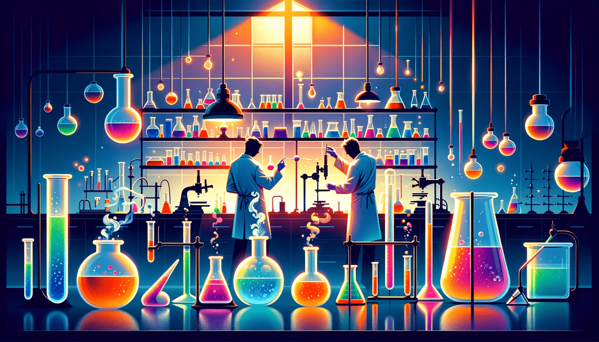

# CHEMISTRY 

## Part-A
### Unit-1 Water chemistry: 

[Introduction, hardness of water (its units, its types, its determination by EDTA 
method using normality equation). Softening of water by lime-soda method, 
ion-exchange method and zeolite method. Boiler feed water: - causes, 
disadvantages, preven on and removal of -scale and sludge formation, 
priming, foaming, caustic embrittlement and boiler corrosion. Different steps 
for water purification to make it fit for drinking: - sedimentation, filtration, 
flocculation, sterilization (using chlorine, bleaching powder, chloramines, 
ozone & UV rays). Desalination of brackish water by electrodialysis and reverse 
osmosis.](https://cg2024-gndec.github.io/chemnotes/#water-treatment)

###  Unit-3 Electrochemistry: 

[Fundamentals of electrochemistry: - electrode, electrodepotential, 
electrochemical series, electrochemical cell, its representation. Nernst 
equation and applications, numerical based on Nernst equation. Different type 
of electrodes: - gas, calomel, quinhydrone electrode. Fuel cell. Solar cell. Li ion 
battery and EV battery](https://cg2024-gndec.github.io/chemnotes/#electrochemistry)

## Part-B
### Unit- 2 Spectroscopic techniques and applications:  

_UV-Visible spectroscopy_: [Instrumentation (flow diagram only of single and 
double beam spectrophotometer and its working) , principle( electronic 
transitions) , auxochrome, chromophore, effect of presence of auxochrome on 
chromophore, bathochromic shift & hypsochromic shift (explanation by using 
the concept of auxochrome), hyperchromic shift , hypsochromic shift , 
applications of UV-VIS spectroscopy (detection of functional group, distinction 
between conjugated and non-conjugated dienes, detection of unknown 
concentration, detection of molecular weight , Fluorescence , phosphorescence 
and isobestic points).](https://cg2024-gndec.github.io/chemnotes/#uv-vis-spectroscopy)  

_IR spectroscopy_: [IR range, fingerprint and functional group region, 
Instrumentation (flow diagram only of single and double beam 
spectrophotometer and difference between these), principle (vibrations in 
diatomic and polyatomic molecules), Hook’s law & applications of IR 
spectroscopy (Peak positions of some common functional groups of organic 
molecules, detec on of conjugation & electronic effect).](https://cg2024-gndec.github.io/chemnotes/#ir-spectroscopy) 

_Nuclear Magnetic Resonance spectroscopy_: [Introduction (magnetic nucleus, 
processional frequency, equivalent and non-equivalent protons), principle and 
instrumentation, discussion of 1HNMR of simple organic molecules (ethane, 
ethyl chloride and phenol) & applications of 1HNMR. (detec on of aromaticity, 
detection of cis and trans isomers, detection of structural isomers and 
detection of electronegative atom). ](https://cg2024-gndec.github.io/chemnotes/#nmr-spectroscopy)

### Important engineering materials: 

[__Polymers__: - Introduction (nomenclature, functionality, type of 
polymerization: addition, condensation and copolymerization). Type of 
polymers: -thermoplastic resins (cellulosederivatives only), thermosetting 
resins (detail of phenolic Resin), inorganic (one example each of 
polyphosphazines, sulphur based polymer & silicones.) & conducting 
polymer. Effect of the polymer structure on its properties. Effect of heat on 
the polymers. The mechanical properties of polymer. Polymer blends and 
alloys. Engineering plastics. Nanomaterials- fullerenes and inorganic 
nanoparticles. Fullerenes: -Introduction, hydrated fullerenes, fullerite, type of 
fullerene (buckyball, nanotubes and graphene), application of fullerenes.
Nanoparticles – Introduction and properties. Optical materials (OLED).](https://cg2024-gndec.github.io/chemnotes/#polymers)
